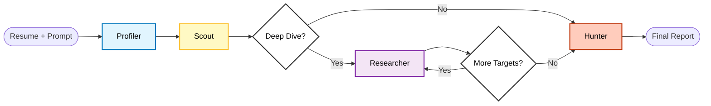

# Headless Hunter

Stop hunting. Start matching.

**Headless Hunter** is a terminal-first, autonomous agent that cuts through the noise of modern job boards. It doesn't just search; it **scouts, scrapes, and analyzes** with a cynical eye to find only the roles that actually fit your profile.

## Demo

https://github.com/user-attachments/assets/59ae443a-76a5-42eb-92dc-3794791c35ff

## Why?

1.  **Aggregator Hell**: Skip the "Ghost Jobs" and sponsored clutter of job boards.
2.  **Deep Intelligence**: Scrapes past the "Show More" buttons to analyze the full job description.
3.  **Privacy First**: Run the entire reasoning engine locally with Ollama. No data leaks.
4.  **Cynical Analysis**: The agent is trained to be skeptical, filtering out roles that don't match your technical depth.

## Quick Start

1. **Env**: `nix develop`
2. **Config**: Copy `.env-example` to `.env` and add API keys.
3. **Input**: Drop your `resume.md` (or `.pdf` / `.txt`) in the root.
4. **Run**: `bun start`

## Workflow & Architecture

### AI Agents

- **Profiler (Strategist)**: Analyzes your resume and prompt to define the perfect "Hunter Profile" (keywords, seniority, vibe).
- **Scout (Lead Sourcer)**: Sweeps global job indices (Tavily) to find high-potential search targets.
- **Researcher (Deep Investigator)**: Visits every target URL, bypassing basic scrapers to extract the _real_ page content.
- **Hunter (Synthesis Agent)**: The cynical closer. It reviews the raw data, cross-references your resume, and writes the final report, filtering out fluff.
- **Recovery**: Automatic self-healing layer for LLM JSON errors.

## Configuration (.env)

| Var                   | Description                                         |
| --------------------- | --------------------------------------------------- |
| `LLM_PROVIDER`        | Default provider (`local` or `google`).             |
| `LLM_PROVIDER_{ROLE}` | Override specific node (e.g. `LLM_PROVIDER_SCOUT`). |
| `GOOGLE_API_KEY`      | Required for Google provider.                       |
| `TAVILY_API_KEY`      | Required for Production Search.                     |

## Dev & Test

- **Lint/Format**: `bun run lint` / `bun run format`
- **Test**: `bun test` (Switches to Free Mode: DDG + Local Scraper).

## License & Copyright

**Copyright (c) 2025-2026 Alexandr Timchenko**

This project is open-source under the **GNU AGPLv3** license.

- **For Open Source / Personal Use**: You are free to use, modify, and distribute this software, **as long as your modifications are also open-source**.
- **For Commercial / Proprietary Use**: If you want to use this code in a closed-source product (SaaS, proprietary backend, etc.) without sharing your changes, you must obtain a **Commercial License**.

> **Contact for Commercial Licensing**: Please open a [GitHub Issue](https://github.com/tmythicator/headless-hunter/issues) with the label 'Commercial Inquiry'.
